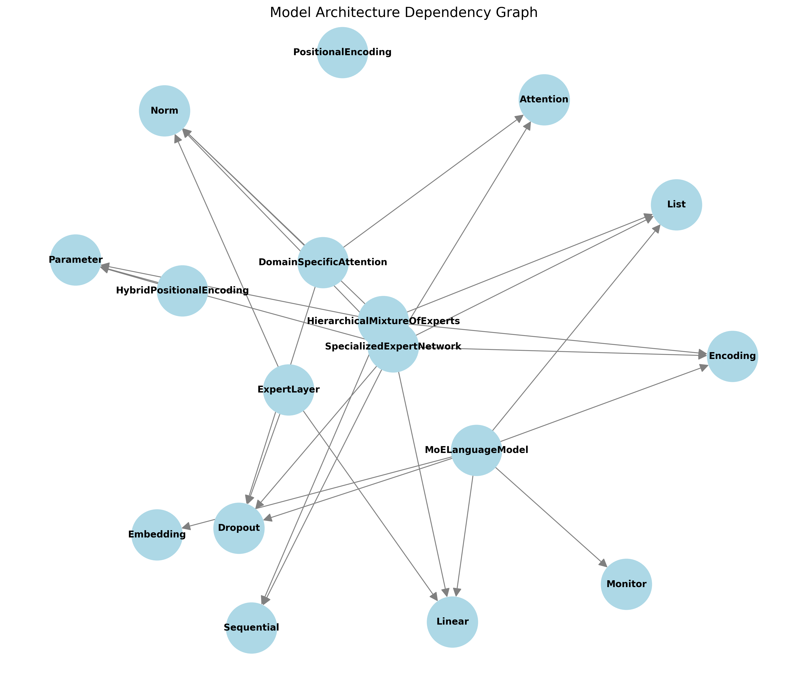
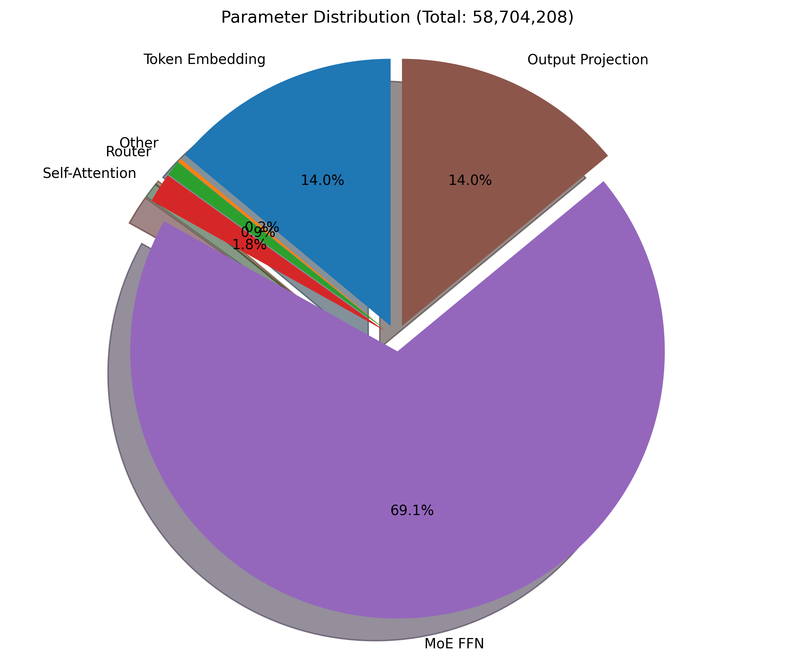

# Mixture-of-Experts Language Model Architecture Report

## 1. Architecture Overview

The Mixture-of-Experts (MoE) Language Model implements a transformer-based architecture with sparse expert routing. 
Each token is processed by a subset of available experts, allowing for specialization and efficient scaling.

## 2. Key Components

### DomainSpecificAttention

Base class for all neural network modules.

[View detailed documentation](class_docs/DomainSpecificAttention.md)

### ExpertLayer

Base class for all neural network modules.

[View detailed documentation](class_docs/ExpertLayer.md)

### HierarchicalMixtureOfExperts

Base class for all neural network modules.

[View detailed documentation](class_docs/HierarchicalMixtureOfExperts.md)

### HybridPositionalEncoding

Base class for all neural network modules.

[View detailed documentation](class_docs/HybridPositionalEncoding.md)

### MoELanguageModel

Base class for all neural network modules.

[View detailed documentation](class_docs/MoELanguageModel.md)

### PositionalEncoding

Base class for all neural network modules.

[View detailed documentation](class_docs/PositionalEncoding.md)

### SpecializedExpertNetwork

Base class for all neural network modules.

[View detailed documentation](class_docs/SpecializedExpertNetwork.md)

## 3. Component Relationships

The diagram below shows the dependencies between different components in the architecture.

## 4. Parameter Analysis

The following section shows parameter distribution for different model configurations.

### Configuration: d256_l2_e8

- Model dimension: 256
- Number of layers: 2
- Number of experts: 8
- Number of heads: 8
- Experts per token (k): 2

## 5. Implementation Notes

### Expert Routing

The router determines which experts should process each token based on the token's features. 
The routing mechanism includes:
- Top-k selection of experts for each token
- Load balancing to prevent expert overutilization
- Capacity factors to handle varying batch sizes
- Expert pruning to eliminate unused experts

### Performance Optimizations

The implementation includes several performance optimizations:
- Vectorized token processing
- Expert-parallel processing
- Memory-efficient attention
- Gradient checkpointing option
- Specialized experts for different domains
